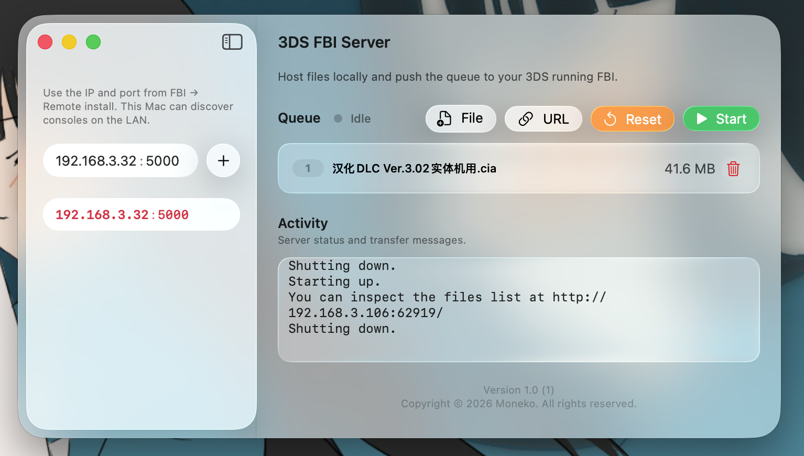
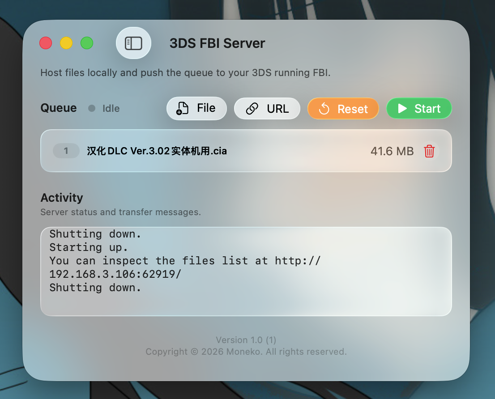
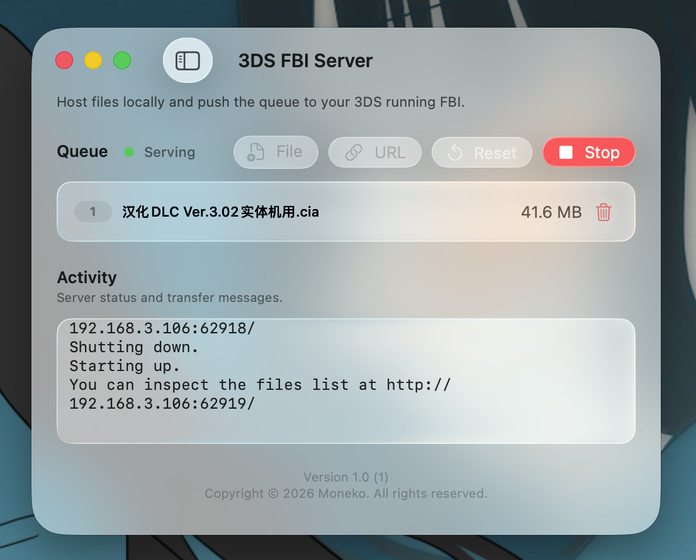

# 3DS FBI Server

在 Mac 上为本机队列中的 CIA / TIK 文件启动小型 HTTP 服务，并通过局域网把安装链接推送给多台已配置 IP 与端口的 **FBI（Remote install）**，从而在 3DS 上远程安装。

## 功能概览

- **控制台列表**：手动添加或编辑 3DS 的 IP 与端口（与 FBI 远程安装里显示的一致）；可选使用局域网 ARP 扫描辅助发现主机。
- **任务队列**：添加本地 `.cia` / `.tik`、文件夹拖入（会枚举其中的 CIA/TIK）、或通过 **http(s)** 链接添加直链；队列内显示序号、进度（传输时）、体积与协议标识。
- **开始 / 停止服务**：开始后在 Mac 上监听 HTTP，并向列表中的控制台下发 FBI 可用的安装 URL；活动日志区域展示状态与传输相关输出。
- **界面**：SwiftUI，适配 macOS 的玻璃风格窗口与分割视图。





## 系统要求

| 项目 | 说明 |
|------|------|
| 系统 | **macOS 26** 及以上（工程当前 `MACOSX_DEPLOYMENT_TARGET = 26.0`） |
| 开发 | **Xcode**（与上述 SDK 匹配）、**Swift 6** |
| 网络 | Mac 与 3DS 在同一局域网；首次使用本地网络时系统会按 `Info.plist` 中的用途说明请求授权 |

## 从源码构建

克隆或解压本仓库后，在终端执行：

```bash
cd 3DS-FBI-Link
open "3DS FBI Server.xcodeproj"
```

在 Xcode 中选择 Scheme **「3DS FBI Server」**、目标 **My Mac**，使用 **⌘B** 编译或 **⌘R** 运行。

命令行编译示例：

```bash
xcodebuild -scheme "3DS FBI Server" -destination 'platform=macOS' build
```

## GitHub Actions（自动 Release + DMG）

推送符合 `v*` 的 **tag**（例如 `v1.0.0`）后，工作流 [`.github/workflows/release.yml`](.github/workflows/release.yml) 会：

1. 使用 **Release** 配置执行 `xcodebuild`
2. 将 `3DS FBI Server.app` 与指向「应用程序」文件夹的快捷方式一并打成 **`UDZO` 压缩 DMG**
3. 使用 **`softprops/action-gh-release`** 创建/更新对应 **GitHub Release**，并上传 **`3DS-FBI-Server-<tag>.dmg`** 作为附件（默认附带自动生成 Release Notes）

示例：

```bash
git tag v1.0.0
git push origin v1.0.0
```

**SDK 与部署版本**：工程默认 `MACOSX_DEPLOYMENT_TARGET = 26`。若 GitHub 托管 runner 上的 Xcode 尚未包含对应 SDK，构建可能失败。可在仓库 **Settings → Secrets and variables → Actions → Variables** 中新增 **`MACOSX_DEPLOYMENT_TARGET_CI`**（例如 `15.0`）作为命令行覆盖；或在具备所需 Xcode 的机器上使用 **self-hosted runner**。工作流文件顶部注释中有相同说明。

## 使用简述

1. 在 **Consoles** 侧栏填写 FBI → Remote install 中显示的 **IP** 与 **端口**，必要时 **Add** 多台机器。
2. 在详情区 **Queue** 中加入要安装的文件或链接。
3. 点击 **Start**（至少需有一台控制台条目）；在 3DS 的 FBI 中使用远程安装接收推送的安装任务。
4. **Reset** 会停止服务并清空队列与控制台列表（并重扫局域网候选）；**Stop** 仅停止 HTTP 服务。

将 `.cia` / `.tik` 拖到程序坞图标或通过系统的「打开方式」关联打开时，应用会将对应文件加入队列（见 `FBI3DSServerApp` / `MacAppDelegate` 相关逻辑）。

## 隐私与权限

- **本地网络**：用于连接局域网内的 3DS；用途文案见 `Info.plist` 中的 `NSLocalNetworkUsageDescription`。
- 本仓库应用为 **Utility** 类别；具体权限以 `3DS FBI Server.entitlements` 为准。

## 许可证

本项目源码以 **MIT License** 发布，详见仓库根目录 [`LICENSE`](LICENSE)。

## 版本与署名

- 应用版本信息见 `3DS FBI Server/Info.plist`（如 `CFBundleShortVersionString`）。
- `Info.plist` 中的应用署名与版权声明仍以其中记载为准；开源授权范围以上述 MIT 许可证为准。

## 免责声明

本工具仅用于在你拥有合法权利的软件副本上进行安装与测试。请遵守当地法律与任天堂及软件许可条款。
